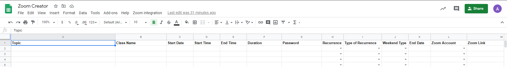

# Zoom and Google Spreadsheet Integration

This Integraton can be used for organizations that use Zoom as their primary video communications platform. It helps the Admininstrators choose the availabe sub Zoom account under their organizations to schedule a meeting. All of that can be done in 1 single Google Spreadsheet.

The Integration is built using API method. Google Spreadsheet will send an API GET request to Zoom to receive the list of meetings of the accounts that are used for scheduling. Based on the data entered by users, it will recommend the users which Zoom account is available to schedule the meeting that users want. If the users choose to schedule the meeting on the recommended accouunt, Google Spreadsheet will send an API POST request to Zoom to create the meeting. If Zoom receive the request successfully, Zoom will response with the meeting URL.

1. Create a blank Google Spreadsheet with the following columns.  

2. Using the Zoom account with the Admin previlege, set up a Zoom OAuth with the appropriate scopes under Zoom Marketplace. The scopes can be group:write:admin/meeting:master/meeting:write:admin/user:master/user:write:admin. Insert the Spreadsheet's URL into the Whitelist URL.

3. Get the sub Zoom accounts along with their Ids that will be used for scheduling meetings. Add the accounts information on a different tab. For the purpose of my project, I have 2 separate tabs for accounts reference. The script will use Sheet 1 to find the available accounts and Sheet 2 to schedule the meeting:
  - Sheet 1 contains the list of accounts which are used strictly for customers and services meeting.
  - Sheet 2 contains accounts that are listed in Sheet 1 and a few more special accounts.

4. Open Script Editor on the Spreadsheet and start coding.
