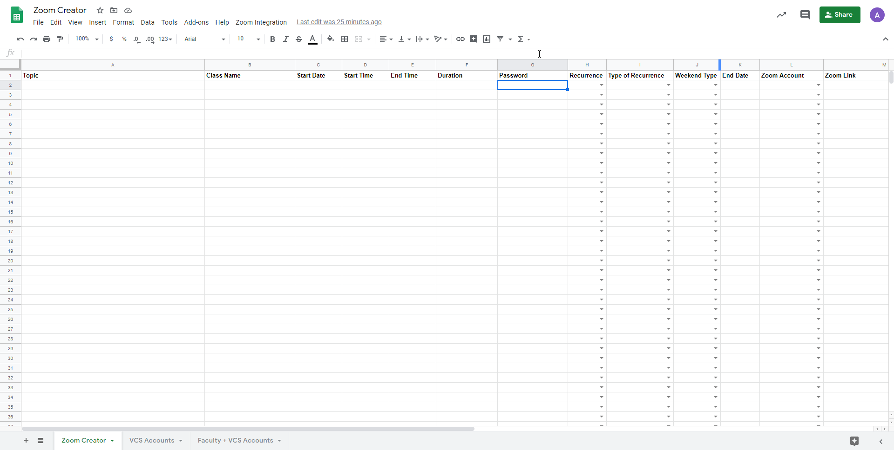

# Zoom and Google Spreadsheet Integration

This Integraton can be used for organizations that use Zoom as their primary video communications platform. It helps the Admininstrators choose the availabe sub Zoom account under their organizations to schedule a meeting. All of that can be done in 1 single Google Spreadsheet.

1. Create a blank Google Spreadsheet. 

2. Set up a Zoom OAuth with the appropriate scopes. The scopes can be group:write:admin/meeting:master/meeting:write:admin/user:master/user:write:admin. Insert the Spreadsheet's URL into the Whitelist URL.

3. Getting the sub Zoom accounts along with their Ids that will be used for scheduling meetings. In this case, it will be all Zoom accounts that have the Licensed account type.

4. 
